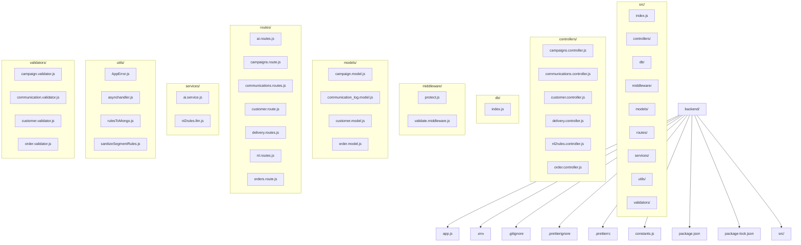

# 📖 Mini CRM Platform – Xeno SDE Internship Assignment 2025

This is a **Mini CRM Platform** built as part of the **Xeno SDE Internship Assignment 2025**.  
It enables customer segmentation, campaign creation & delivery, and integrates AI features like **Natural Language → Segment Rules** & **AI-driven message suggestions**.

---

## 🛠️ Tech Stack
- **Frontend:** React (Vite, TailwindCSS, Clerk for Auth)  
- **Backend:** Node.js (Express, MongoDB, Zod Validators, Mongoose ODM)  
- **Database:** MongoDB (customers, orders, campaigns, communication_log)  
- **Auth:** Google OAuth 2.0 via Clerk  
- **AI:** OpenAI API for NL→rules & message suggestions  

---

## 📂 Folder Structure

### ✅ Mermaid Diagram (GitHub‑compatible)


### Plain Tree
```
backend/
├─ app.js
├─ .env
├─ .gitignore
├─ .prettierignore
├─ .prettierrc
├─ constants.js
├─ package.json
├─ package-lock.json
└─ src/
   ├─ index.js
   ├─ controllers/
   │  ├─ campaigns.controller.js
   │  ├─ communications.controller.js
   │  ├─ customer.controller.js
   │  ├─ delivery.controller.js
   │  ├─ nl2rules.controller.js
   │  └─ order.controller.js
   ├─ db/
   │  └─ index.js
   ├─ middleware/
   │  ├─ protect.js
   │  └─ validate.middleware.js
   ├─ models/
   │  ├─ campaign.model.js
   │  ├─ communication_log.model.js
   │  ├─ customer.model.js
   │  └─ order.model.js
   ├─ routes/
   │  ├─ ai.routes.js
   │  ├─ campaigns.route.js
   │  ├─ communications.routes.js
   │  ├─ customer.route.js
   │  ├─ delivery.routes.js
   │  ├─ nl.routes.js
   │  └─ orders.route.js
   ├─ services/
   │  ├─ ai.service.js
   │  └─ nl2rules.llm.js
   ├─ utils/
   │  ├─ AppError.js
   │  ├─ asynchandler.js
   │  ├─ rulesToMongo.js
   │  └─ sanitizeSegmentRules.js
   └─ validators/
      ├─ campaign.validator.js
      ├─ communication.validator.js
      ├─ customer.validator.js
      └─ order.validator.js
```

---

## 🏗️ System Architecture
```mermaid
flowchart LR
  subgraph CLIENT[Frontend]
    UI[Campaign UI & History]
    AUTH[Clerk / Google OAuth Token]
  end

  subgraph API[Backend (Node / Express)]
    ROUTES[/REST Routes/]
    CTRL[Controllers]
    ZOD[Zod Validators]
    MID[Middleware]
    UTIL[Utils]
  end

  subgraph AI[AI Provider]
    LLM[(LLM)]
  end

  subgraph DB[(MongoDB)]
    CUST[(customers)]
    ORD[(orders)]
    CAMP[(campaigns)]
    LOG[(communication_log)]
  end

  subgraph VENDOR[Dummy Vendor API]
    SIM[Delivery Simulator]
  end

  AUTH --> MID
  UI --> ROUTES
  ROUTES --> MID --> ZOD --> CTRL
  CTRL --> CUST
  CTRL --> ORD
  CTRL --> CAMP
  CTRL --> LOG
  CTRL --> LLM
  CTRL --> SIM
  SIM -- Delivery Receipt --> ROUTES
```

---

## 🔑 Key Features
- ✅ Customer & Order ingestion APIs (with validation)  
- ✅ Campaign creation with **dynamic rule builder**  
- ✅ Campaign history + delivery stats  
- ✅ Dummy vendor API simulating SENT/FAILED + Delivery Receipt logging  
- ✅ Google OAuth 2.0 authentication (Clerk)  
- ✅ AI-powered **Natural Language → Rules** & **Message Suggestions**  
---

## 🚀 Running Locally
```bash
# 1. Clone repo
git clone https://github.com/<your-repo>.git
cd backend

# 2. Install dependencies
npm install

# 3. Create .env file
MONGO_URI=mongodb+srv://...
CLERK_SECRET_KEY=...
OPENAI_API_KEY=...

# 4. Start dev server
npm run dev
```

---

## ⚠️ Limitations & Assumptions
- Clerk session tokens are **short-lived** → may need refreshing in Postman.  
- Vendor API is a **mock simulator** (not real SMS/email).  
- AI outputs are **non-deterministic** (results vary).  
- Pub/Sub is **optional** and mocked in local setup.  
